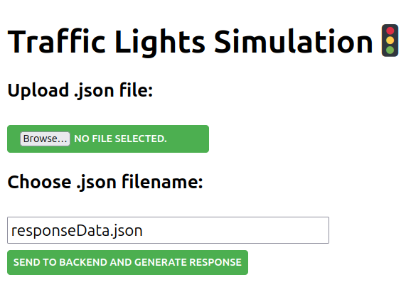

# Traffic Lights Simulator
Backend: `Java, Spring Boot` \
Frontend: `React` \
IDE: `Intellij IDEA`

# Preparation
First ensure that `Node.js` and `npm` is installed \
Ensure that `java` is installed:
```
java -version
```


# How to run
Import repository to your local enovironment \
Open terminal
To activate Spring Boot Rest API:
```
./gradlew BootRun
```
This will set up Rest API on port 8080 \
To start React developement server:
```
cd reactapp
npm start
```
Now Traffic Lights Simulator is available at:
```
localhost:3000
```

